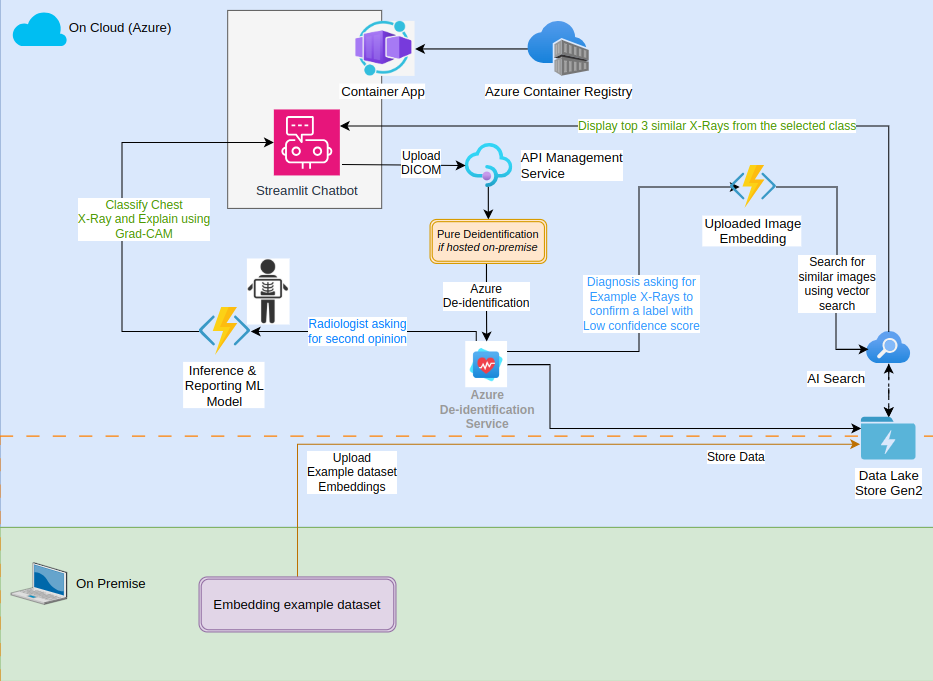

# RAISO Bot – Radiology AI Second Opinion App

RAISO (Radiology AI Second Opinion) is a minimal yet functional DICOM viewer powered by AI, designed to provide clinicians with a quick second opinion using open-source deep learning models. Built API-first and cloud-ready for healthcare use cases.

🛰️ **Live App**: [RAISO on Azure](https://raiso-container-app.ambitiousmoss-b2a629ad.westus.azurecontainerapps.io/)  
📖 **Behind the Scenes**: [Read the full story](https://shorthaired-cobweb-95c.notion.site/RAISO-Radiology-AI-Second-Opinion-App-on-Top-of-Azure-1f831893bffc80a385ddc16c3e76fd4c)  
🔑 **Request a Key**: [contact@captaincto.com](mailto:contact@captaincto.com)

---

## 🧠 About the Project

RAISO is a lightweight radiology assistant that brings second opinions to clinicians in just a few clicks — with full respect for patient data privacy and compliance.

It works like this:

- ✅ Accepts DICOM or PNG/JPG chest X-ray uploads.
- ✅ Pseudonymizes metadata client-side (to avoid transmitting any sensitive identifiers).
- ✅ Sends the image to a deployed AI model for inference.
- ✅ Returns a ranked list of possible findings (e.g. pneumothorax, effusion, cardiomegaly).
- ✅ Highlights abnormal cases with color-coded severity.
- ✅ Stores results securely for later review (optional for users with access).
- ✅ All wrapped in a clean, responsive Streamlit-based frontend.

And all of this runs entirely on **Azure**, built with compliance and performance in mind.

---

## 🏗️ App Architecture (On Azure & On-premise)

RAISO leverages the best of Microsoft Azure to ensure performance, scalability, and healthcare compliance:

- **Azure Container Apps** (deployment target)
- **Azure Container Registry** (for hosting the app container) replaced later with **GitHub Container Registry** to optimize costs.
- **Azure AI Search** (for searching for 3 X-rays from the NIH Chest X-Ray dataset that are most similar to the uploaded file with selected possible diagnosis)
- **Azure Data Lake Gen2** (storage for NIH Chest X-Ray dataset - partial - as PNG and image vector embeddings)
- **Azure API Management** (for secure, scalable API exposure with easy - per user - monitoring and usage limit setting)

To optimize costs, some processes are run on-premise:
- **On-premise Example DICOMs Embedding** (using MedClip, for getting image embedding vectors for the searchable dataset)



---

## 🚀 Running Locally (Docker, Port 8000)

To run RAISO on your machine using Docker:

```bash
# Clone the repo
git clone https://github.com/OmarLaham/RAISO-Bot.git
cd RAISO-Bot

# Build the Docker image
docker build -t raiso .

# Run the container and expose it on port 8000
docker run -p 8000:8000 raiso
```

Then open your browser and navigate to:
👉 http://localhost:8000

---

## 🤝 Contribute To The Project

Whether you're into radiology, DICOM parsing, AI inference, or cloud architecture — this is a project you can build on. Fork, clone, explore — and feel free to open an issue or pull request.